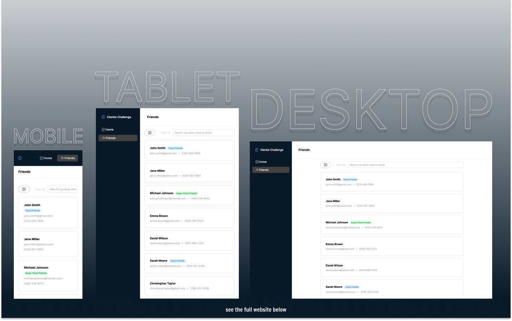

This is a [Clerkie Front End Web Developer Challenge](https://www.clerkie.io/) made by [Karapet Nersisyan](https://www.ken.engineer/).

## Table of contents

- [Overview](#overview)
  - [The challenge](#the-challenge)
  - [Screenshot](#screenshot)
  - [Links](#links)
- [My process](#my-process)
  - [Built with](#built-with)
  - [Continued development](#continued-development)
  - [Useful resources](#useful-resources)
- [Author's Links](#authors-links)

## Overview

### The challenge

Users should be able to:

- Implement the Figma design exactly. All icons, layouts, and cases are provided in the Figma file. There should be no visible difference between a screenshot of the Figma design and the live site.
- Build the site with only what is provided in the Next.js starter project and don’t use any external component or helper libraries. We want to be able to see all your skills at work
- Interpret everything required by the design which includes all interactions, routing, data handling, and error checking.

### Screenshot

### Links

- Live Site URL: [https://clerkie-challenge-seven.vercel.app/friends](https://clerkie-challenge-seven.vercel.app/friends)

## My process

### Built with

- Next.JS
- Mobile-first workflow

## Author's Links

- LinkedIn - [Karapet (Ken) Nersisyan](https://www.linkedin.com/in/karo-nersisyan-135118129/)
- Medium - [@kens_visuals](https://medium.com/@kens_visuals)
- CodePen - [@kens-visuals](https://codepen.io/kens-visuals)
